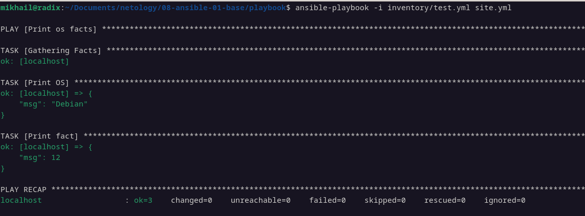
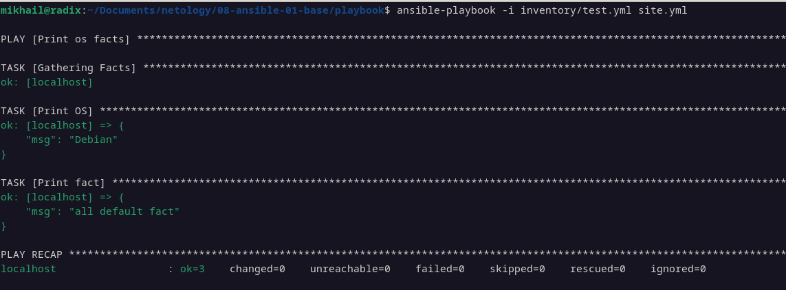
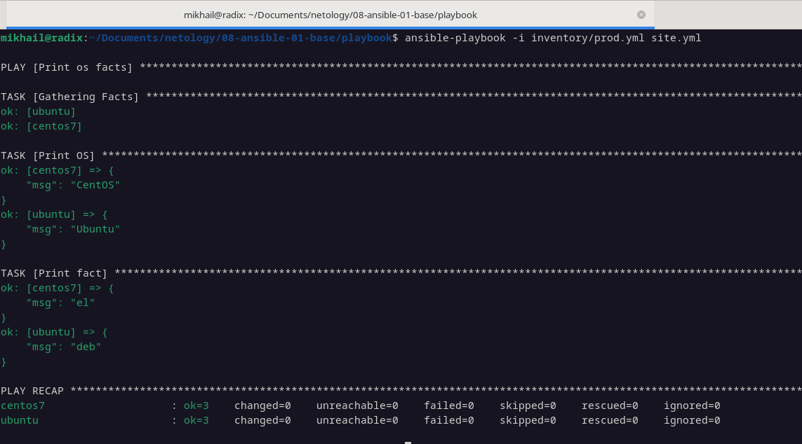
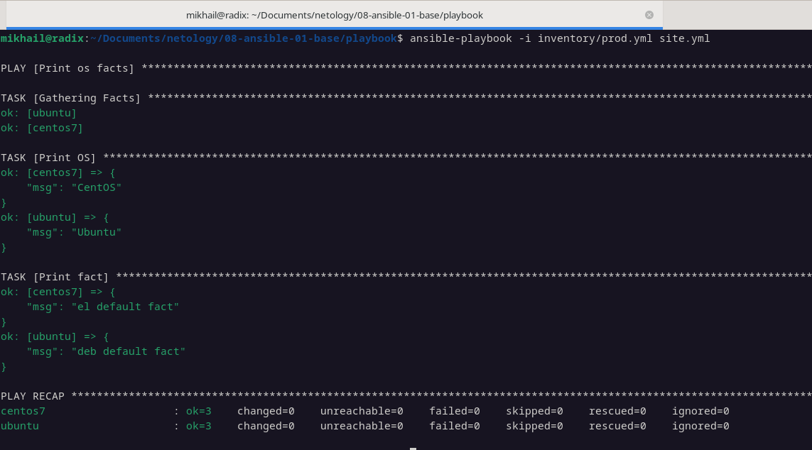
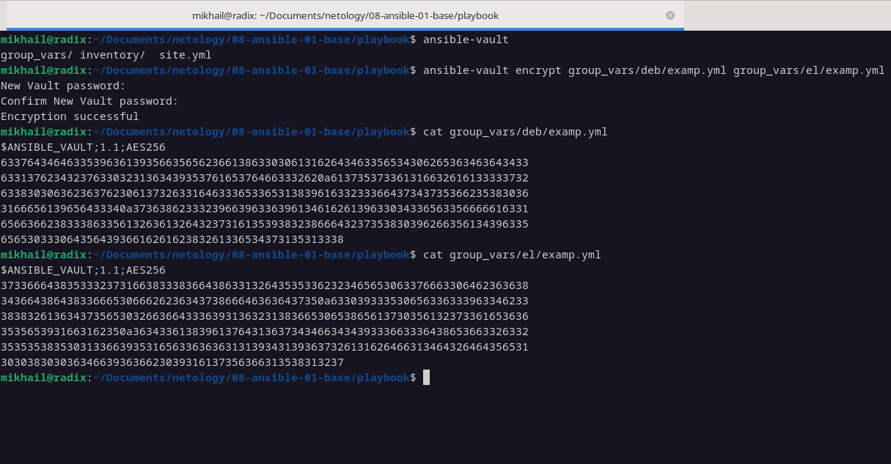
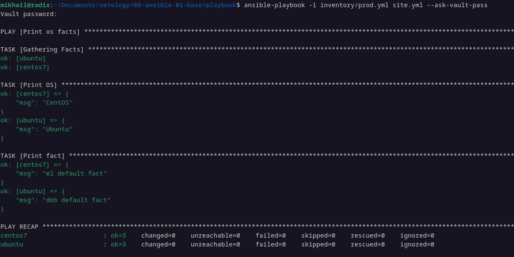
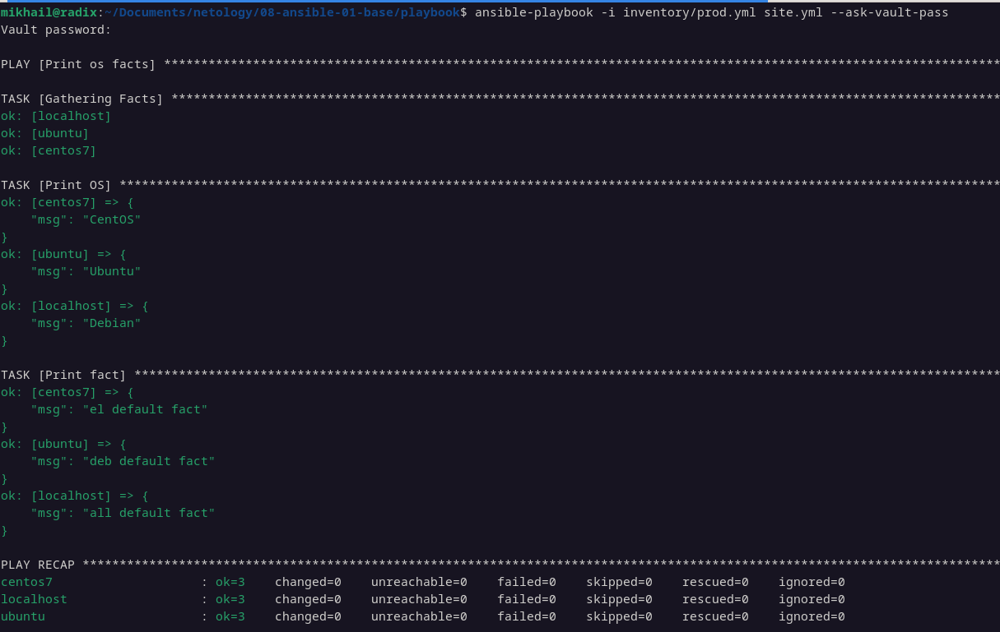

# 08-ansible-01-base
1. Запускаем playbook test.yml.

2. Изменили переменную some_fact на "all default fact".

3-4. Создали 2 контейнера с ubuntu и centos. Запустили playbook на окружении prod.yml. 

5-6. Добавили факты в group_vars для каждой группы.

7. Шифруем факты через ansible-vault.

8. Исполняем playbook с зашифрованными фактами.

9-11. Добавили группу хостов local. Запустили playbook на окружении prod.yml 

